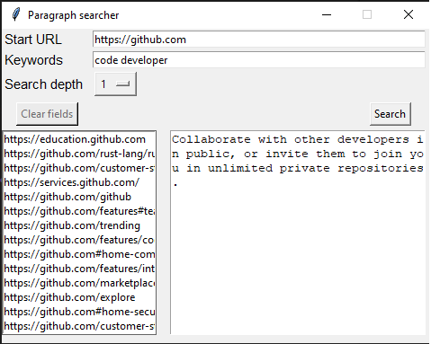

# Paragraph search

Really simple webscraper, which searches for sentences inside paragraph tags, based on given keywords.

## Running the code

Currently this can be used on:
* command line with search.py (missing support for multiple keywords, needs work). Example:
`python3 search.py https://github.com/ 1 code`
* and from simple GUi, `gui.pyw`. Currently supports multiple words.

## TODO
* fix case sensitivity
* fix stopping abort (terminating thread)
* add scrollbar https://stackoverflow.com/questions/13832720/how-to-attach-a-scrollbar-to-a-text-widget
* split search keywords to two columns, one for pages one for found paragraphs
* add statistics etc.